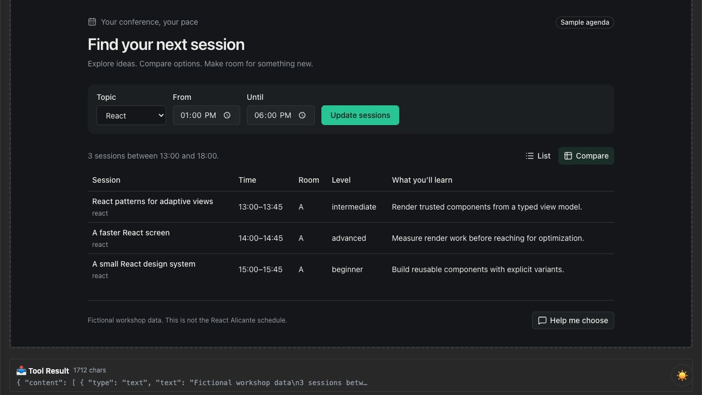
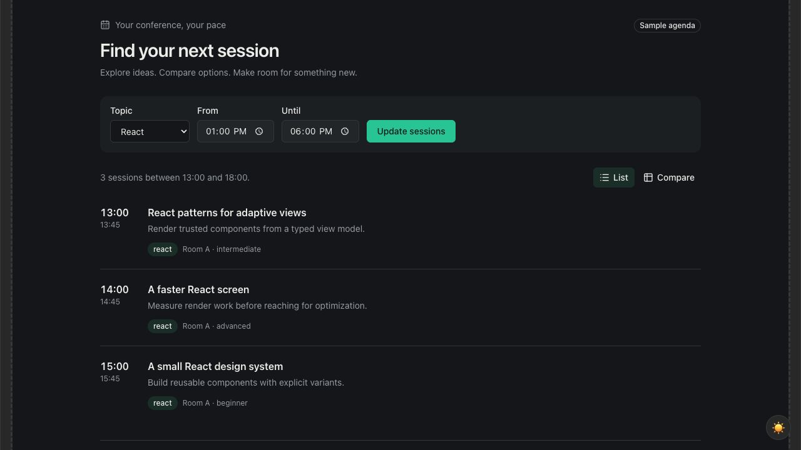

<!-- _class: lead -->

# Building Generative UI<br>with MCP in React

Glenn Reyes  
React Alicante · September 24, 2026

<!--
Welcome. This is a 3.5-hour collaborative workshop. Participants can code manually, pair or use their preferred coding agent. No paid AI account is needed for the exercises. Materials: https://github.com/glennreyes/generative-ui-mcp-workshop
-->

---

<!-- _class: image -->

# The Conference Agenda Assistant



One tool. Twelve fictional sessions.  
A list, a comparison and a filter.

<!--
Show the completed demo live, then use this actual screenshot as the fallback. State that all sessions are fictional, not the React Alicante schedule. Call show_sessions with topic react, startTime 13:00 and view compare. Three records should appear.
-->

---

# How we’ll work

Predict the result before changing the code.  
Build a small change, then read the diff.  
Run it and explain what happened.

Manual coding, pairing and agents all work.

<!--
The coding agent helps build the app. The conversational model later chooses tools in the finished app. These are different roles. Use checkpoints to recover without overwriting participant work. Ask attendees to predict one filter result now.
-->

---

# Intent and presentation

“Show me React sessions this afternoon.”  
→ topic: react · startTime: 13:00 · view: list

“Compare them so I can choose.”  
→ same filters · view: compare

<!--
Generative means the model chooses among supported, validated arguments and presentations. React is trusted application code. We are not running model-generated JSX, HTML or JavaScript. The local test host makes the arguments explicit; the instructor demonstrates natural language in a compatible host.
-->

---

# The application flow

Model chooses the tool and arguments  
Host calls the MCP server  
Server returns data and a UI resource reference  
Host loads React in a sandbox  
React calls tools through the host bridge

<!--
Trace this flow in docs/architecture.md. Tools do work; resources supply content. The ui:// identifier is an MCP resource URI, not an HTTP page. Our local host replaces model selection with a tool form. Source: https://modelcontextprotocol.io/extensions/apps/overview
-->

---

# The tool contract

```ts
show_sessions({
  topic: "react",
  startTime: "13:00",
  endTime: "18:00",
  view: "compare",
});
```

Zod validates inputs and structured results.

<!--
Open packages/agenda/src/schema.ts. Defaults live in one schema. Explain the complete-attendance time-window rule. content provides a readable text fallback; structuredContent supplies the typed result. Source: https://ts.sdk.modelcontextprotocol.io/v2/
-->

---

# Exercise 1 · The session tool

Filter by topic and the complete time window.  
Return typed data and useful fallback text.  
Try a valid empty result and an invalid input.

30 minutes · 00-start → 01-tool

<!--
Open docs/exercises/01-tool.md. Ask whether the 15:00–15:45 session belongs in a window ending at 15:00. It does not. Expected React 13:00–15:00 result: react-patterns and react-performance. Read the diff and show the actual tool result before moving on. Break follows this block.
-->

---

# Exercise 2 · The React resource

```ts
_meta: {
  ui: { resourceUri: "ui://agenda/sessions.html" }
}

useApp → ontoolresult → validated React state
```

35 minutes · 01-tool → 02-react-ui

<!--
Open docs/exercises/02-react-ui.md and apps/server/src/server.ts. Register the single-file resource using RESOURCE_MIME_TYPE. Explain that the UI handler is installed before connect. Keep content text fallback and CSP metadata. Source: https://apps.extensions.modelcontextprotocol.io/api/documents/migrate-to-v2.html
-->

---

<!-- _class: image -->

# Exercise 3 · Trusted views



The same records, selected by result.view.  
25 minutes · 02-react-ui → 03-views

<!--
Open docs/exercises/03-views.md. Add the comparison Table using the existing shadcn components. Call from the host with view list, then compare. UI buttons are completed in exercise 4. The screenshot shows the actual list rendering. Break follows this block.
-->

---

# Exercise 4 · UI to server

```ts
const result = await app.callServerTool({
  name: "show_sessions",
  arguments: filters,
});

return sessionResultSchema.parse(result.structuredContent);
```

30 minutes · 03-views → final

<!--
Open docs/exercises/04-interaction.md. The snippet shows the data path; the implementation also checks isError and supplies a timeout. A UI-initiated result returns to the caller; do not wait for a new ontoolresult event. Review pending, error and stale-result handling in app.tsx. Source: MCP Apps SDK app.callServerTool documentation.
-->

---

# Context and conversation

updateModelContext shares the current selection.  
sendMessage asks the host to continue.

The local host records these messages.  
A conversational host can respond.

<!--
Click Help me choose in the prepared host and inspect Messages. The message contains the visible session IDs and applied filters. Check host capabilities, handle rejection and preserve the main browsing interaction if follow-up is unsupported. Source: https://modelcontextprotocol.io/extensions/apps/overview
-->

---

# Loading, empty results and errors

Keep the last useful result during a request.  
Disable duplicate submissions.  
Explain an empty result and how to recover.  
Validate data on both sides of the bridge.  
Keep useful text when a host cannot render UI.

<!--
Demonstrate an empty 17:00–18:00 window, then a reversed window and recovery. Do not replace working data with a blank screen while loading. Untrusted strings render as text. The sandbox and typed contract have different jobs. A read-only example avoids real booking side effects.
-->

---

# Pair challenge

Add a room filter to schema, server and UI.  
Or add a timeline as a new trusted view.

Preserve the other filters. Add one useful test.  
20 minutes · Show the actual result

<!--
Open docs/exercises/05-challenge.md. Prefer the room-filter option if short on time. Ask pairs to show the changed tool argument and output, not just the screen. The timeline is a stretch option; think about simultaneous sessions.
-->

---

# Keep building

github.com/glennreyes/generative-ui-mcp-workshop

Setup · exercises · solutions · slides

Build with Glenn on Discord  
discord.gg/8p3uGHNMu

<!--
Reserve the final fifteen minutes for Q&A and recovery. Ask attendees to name the model, host, tool, resource and React responsibilities. Share the final checkpoint and invite follow-up in #react-alicante-2026. Conference: https://reactalicante.es . Reusable description: docs/workshop.md.
-->
